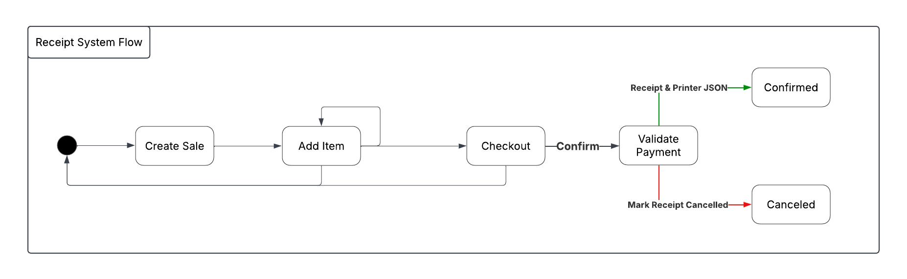

# 📦 Inventory Management Web App – Vortex Solution

A web-based inventory management system built to streamline warehouse operations and sales tracking. This project serves as a proof-of-concept (POC) with plans for future integration of barcode scanning and POS systems.

---

## Project Goals & Vision

### Version 1: Proof of Concept (Current)
- Add, remove, or sell items from inventory via web interface.

### Version 2: Barcode Integration
- Automatically generate unique SKU for new items.
- Print barcodes for tagging products.

### Version 3: Barcode Scanning
- Use USB barcode scanner to retrieve item info.
- Update inventory and finance tables upon sales or removal.

### Version 4: Enterprise POS Integration *(Future Goal)*
- Integrate with POS systems to process payments.
- Automatically reduce inventory and record sales upon payment success.

---

## Prerequisites

- **Java** 17 or higher
- **Gradle** (Wrapper included)
- **MySQL** (Database setup required >> FUTURE)

---

## Contributing
To contribute, please follow the steps below to ensure a smooth and successful submission

### Setup

1. **Clone the Repository**
Clone the repository to your local machine in your desired path (traverse to it using cd in terminal):
    ```bash
    git clone https://github.com/Vortex-Sol/InventoryManagementWeb.git
    cd InventoryManagementWeb   
    ```

2. **Create a New Branch**
Create a new branch to isolate your changes & features. Use a descriptive branch name:
    ```bash
    git checkout -b feature.name-category
    ```

Where:
   - Feature is the code you are working on
   - Category is the status of the feature; **use**: 
     - _fix_ [You are fixing a bug]
     - _patch_ [You forgot to add something] 
     - _update_ [You are creating a new feature] 
     - _temp_ [You are temporarily introducing a feature -> to be removed later]
     
Example branch name:
```
git checkout -b report.system-update
```
    
> **Tip:** Avoid making changes on the main branch explicitly

### Submitting Changes
1. **Make Your Changes**
   - Make your edits or additions to the codebase
   - Ensure your code is **formatted properly** and follows standard style guides
   - **Write test**, if applicable, for any new functionality
   - Verify everything works correctly before commiting

2. **Fetch Newest  Main**
    - Make sure you are on the newest main
    - Do ```git fetch origin main```
    - To resolve any merge conflicts >> contact the team
   
3. **Commit Your Changes**
Use clear, descriptive commit messages
    ```bash
    git add .
    git commit -m "Update: implemented Report System" -m "I created the appropriate Mappers, DTOs and Models. We are missing a service class"
    ```
4. **Push to Your Fork**
Push changes to your forked repository:
    ```bash
    git push origin report.system-update
    ```

5. **Open a Pull Request (PR)**
- Go to the original repository on GitHub
- Click "Compare & Pull Request" next to your recently pushed branch
- Title should be relevant feature issue
  - for e.g., **[3B] Report System**
- Provide a detailed description of your changes and what they do
  - for e.g., _The report system creates reports based on period or time for employees, receipts, inventory or all. A report includes...._ 
- Submit the pull request for review
  - assign 2 team members as reviewers to review your changes
  - assign yourself as an assignee
  - assign a label to the pull request

6. **Respond to Review Feedback**
- Be responsive to any comments, questions or change requests from the team members
- Push follow-up commits to the same branch; the PR will update automatically
- Finally merge to main once everyone approve

---

## Installation

1. **Clone the Repository**
   ```bash
   git clone https://github.com/Vortex-Sol/InventoryManagementWeb.git
   cd InventoryManagementWeb
   ```
   
2. **Build the Application**
    ```bash
    ./gradlew build
    ```
    
3. **Run the App**
    ```bash
    ./gradlew bootRun
    ```
    and access locally

---

## System Users

| Role     | Responsibilities                                                  |
|----------|-------------------------------------------------------------------|
| Salesman | Sell items, view sales history                                    |
| Stocker  | Add/write-off/update/delete items                                 |
| Manager  | Same as Salesman & Stocker, has access to report & receipt system |
| Admin    | Has IT settings system                                            |

---

## Technology Stack

| Layer      | Technology                                   |
|------------|----------------------------------------------|
| Frontend   | HTML, CSS, Bootstrap 5, JavaScript           |
| Templating | Thymeleaf (Server-side rendering)            |
| Backend    | Java Spring Boot (MVC)                       |
| Security   | Spring Security with JWT, Email Verification |
| ORM        | Spring Data JPA (Hibernate)                  |
| Database   | H2 (Development) & MySQL (Production)        |
| Testing    | JUnit, Mockito, Spring Test                  |

---

## Core Functionalities
Core Functionalities are tied to a user's warehouse. That is, user can only overlook and operate within his Warehouse bounds.

### Common to All Users
- Login / Logout

### Stocker
- Add Item
- Delete Item
- Edit Item
- Write-off (damaged/lost)
- Manual Stock Adjustments

### Salesman
- Sell Item
- Search by ID/Name/Barcode
- View Own Sales History

### Manager
- Salesman & Stocker Functionalities
- Capable of checking All employee data
- Employee, Sales & Inventory Reports
- Export to Google Sheets (optional)
- Dashboard with charts/statistics (optional)

### Admin
- Manages warehouse contact details
- Add/edits/removes employees
- He can set settings regarding stock, reports, cash count times and more

---

## API Endpoints

### Admin - [AdminController](src/main/java/vortex/imwp/controllers/AdminController.java)
| Method | Endpoint             | Description                      |
|--------|----------------------|----------------------------------|
| GET    | `/api/admin`         | Retrieves admin dashboard        |
| GET    | `/api/register`      | Loads Employee registration page |
| POST   | `/api/register`      | Creates Employee                 |

### Authentication - [AuthController](src/main/java/vortex/imwp/controllers/AuthController.java)
| Method | Endpoint        | Description             |
|--------|-----------------|-------------------------|
| GET    | `/auth/login`   | Retrieves login         |
| POST   | `/auth/logout`  | Logout and revoke token |

### Home - [HomeController](src/main/java/vortex/imwp/controllers/HomeController.java)
| Method | Endpoint    | Description                            |
|--------|-------------|----------------------------------------|
| GET    | `/api/home` | Redirects user to his appropriate home |

### Inventory - [InventoryController](src/main/java/vortex/imwp/controllers/InventoryController.java)

| Method | Endpoint              | Description                 |
|--------|-----------------------|-----------------------------|
| GET    | `/api/items`          | List all items (filterable) |
| GET    | `/api/items/{id}`     | Get item details            |
| POST   | `/api/items/add`      | Create new item             |
| GET    | `/api/items/search`   | Finds list of items         |
| PUT    | `/api/items/{id}`     | Update item                 |
| DELETE | `/api/items/{id}`     | Delete item                 |
| GET    | `/api/items/checkout` | Retrieves checkout page     |

### Warehouse - [WarehouseController](src/main/java/vortex/imwp/controllers/WarehouseController.java)
| Method | Endpoint         | Description                                                               |
|--------|------------------|---------------------------------------------------------------------------|
| GET    | `/api/warehouse` | Retrieves stocker's warehouse information on items, quantity with filters |

### Sales - [SaleController](src/main/java/vortex/imwp/controllers/SaleController.java)
| Method | Endpoint            | Description             |
|--------|---------------------|-------------------------|
| GET    | `/api/sales`        | List sales (filterable) |
| POST   | `/api/sales`        | Record a new sale       |
| GET    | `/api/sales/{id}`   | Sale details            |
| POST   | `/api/sales/{id}`   | Updated entity          |
| DELETE | `/api/sales/{id}`   | Deleted sale            |                 

### Employees - [EmployeeController](src/main/java/vortex/imwp/controllers/EmployeeController.java)
| Method | Endpoint              | Description               |
|--------|-----------------------|---------------------------|
| GET    | `/api/employees`      | Returns all employee      |
| GET    | `/api/employees/{id}` | Returns specific employee |
| POST   | `/api/employees`      | Create user               |
| PUT    | `/api/employees/{id}` | Update user               |
| DELETE | `/api/employees/{id}` | Delete user               |

### Receipts - [ReceiptController](src/main/java/vortex/imwp/controllers/ReceiptController)
| Method | Endpoint                           | Description                                                                                                                                |
|--------|------------------------------------|--------------------------------------------------------------------------------------------------------------------------------------------|
| GET    | `/api/receipt/checkout/{saleId}`   | Show checkout page for a given sale, including item totals and total amount.                                                               |
| GET    | `/api/receipt/confirm/{receiptId}` | View a confirmed receipt and its JSON representation.                                                                                      |
| GET    | `/api/receipt/{saleId}/add-items`  | Display page to add items to a sale, showing available items, stock, and warehouses.                                                       |
| GET    | `/api/receipt/start-checkout`      | Create a new sale for the authenticated user and redirect to the add-items page.                                                           |
| POST   | `/api/receipt/checkout`            | Process checkout for a sale with specified payment method and optional amount received; redirects to receipt confirmation or shows errors. |
| POST   | `/api/receipt/addItem-form`        | Add an item to a sale via item ID or barcode, with quantity and warehouse; redirects back to add-items page with possible errors.          |
| POST   | `/api/receipt/cancel/{receiptId}`  | Cancel a receipt; redirects to receipt confirmation page with success or error message.                                                    |

### Reports - [ReportController](src/main/java/vortex/imwp/controllers/ReportController.java)
| Method | Endpoint                        | Description                                                                               |
|--------|---------------------------------|-------------------------------------------------------------------------------------------|
| GET    | `/api/reports/employees/today`  | Generate employee activity report for today.                                              |
| GET    | `/api/reports/employees/period` | Generate employee activity report for a specific period (`start` and `end` query params). |
| GET    | `/api/reports/inventory`        | Generate inventory report for the authenticated user.                                     |
| GET    | `/api/reports/inventory/today`  | Generate inventory report for today.                                                      |
| GET    | `/api/reports/inventory/period` | Generate inventory report for a specific period (`start` and `end` query params).         | 
| GET    | `/api/reports/sales`            | Generate sales report; optionally filter by period using `start` and `end` query params.  |
| GET    | `/api/reports/sales/today`      | Generate sales report for today.                                                          |
| GET    | `/api/reports/sales/period`     | Generate sales report for a specific period (`start` and `end` query params).             |

### Settings - [SettingsController](src/main/java/vortex/imwp/controllers/SettingsController.java)
| Method | Endpoint        | Description                                                 |
|--------|-----------------|-------------------------------------------------------------|
| GET    | `/api/settings` | Retrieve current settings for the authenticated admin user. |
| POST   | `/api/settings` | Update settings for the authenticated admin user.           |


---

## Database

### Diagrams

- Entity Relationship Diagram

- Use Case Diagram

- Class Diagram


---

### Database Schema (SQL)

> Full SQL setup for H2 is available under [schema.sql](src/main/resources/sql/schema.sql).

---

## Systems

### Audit System

Audits should be created for the following entities, data and their respective situations:

| Entity               | Situation                                          | Data                                              |
|----------------------|----------------------------------------------------|---------------------------------------------------|
| LoginAudit           | Whenever a user attempts to login to a username    | Username, IP Address, Login Time, Success/Failure |
| SettingChangeAudit   | When an ADMIN has changed his Warehouse's settings | Time, Settings Changed                            |
| ItemChangeAudit      | Any time a STOCKER changed an item                 | Time , Fields/information changed                 |
| WarehouseChangeAudit | Activates when STOCKER changed                     | Time, Fields changed                              |                              

> When ever "changed" is mentioned - this means: ```edited/added/removed/created```

### Notification System

#### Types
| Receiver | Situation                                           | Urgency |
|----------|-----------------------------------------------------|---------|
| ADMIN    | # Failed login attempts > 3 **@** [USERNAME]        | High    |
| MANAGER  | Cash Discrepancy                                    | High    |
| SALESMAN | Cancelled Transaction                               | High    |
| STOCKER  | Low Stock of Item [SKU]                             | Medium  |
| STOCKER  | New Stock came of Item [SKU]                        | Medium  |
| STOCKER  | Stock Transfer Request (Warehouse A --> Warehouse B | Low     |

#### Architecture
> Work in progress

### Report System

#### Report Types
- Salesman
- Inventory
- Receipts
- General (all 3)

#### Reports Time-wise
- Period, e.g. from 15th to 20th FEB
- Today

#### Employee Report
- Login audits
- Logout audits
- Receipts an employee (SALESMAN) was responsible for

#### Inventory Report
- New quantity of products (from shipment)
- Quantity old vs new
- Item name, sku, id

#### Receipt Report
- Items bought
- Receipt ID
- Total cost
- Cancelled true/false
- [INVOICE] Company name, nip, address
- Refund true/false

> Important to note that these reports are to include data not on just 1 instance, i.e. it can include information on multiple products/employees/receipts

### Receipt System

Receipt system handles checkout, receipt generation, and cancellation. 
Key Components:
- ReceiptController: Manages add-items, checkout, confirm, cancel.
- ReceiptService: Creates receipts, validates payments, generates printer JSON, cancels receipts.
- ReceiptDTO: Data transfer for UI/API.
- Models: Receipt, Sale, SaleItem.

#### Main Flow


````
1. Start Checkout → Create Sale → Add Items.
2. Add Items → By barcode or selection.
3. Checkout → Validate payment, create Receipt.
4. Confirm → Show receipt & printer JSON.
5. Cancel → Mark receipt cancelled.
````

#### Validation Rules
- Cash: amountReceived >= total.
- Cannot cancel twice.
- Barcode lookup preferred.

#### Printer JSON
- header, items, payments, optional cancellation, footer.

#### Next Steps
- VAT mapping.
- Refund integration.
- Inventory sync.
- Reporting integration.

### Request System (FUTURE)

### Setting System

#### Settings Fields
1. Alert When a Stock is Low (True / False) >> if true the notification system (we need to build a notification system but this is for the future) sends email
2. Auto Generate a Report: (True / False)
3. Set Auto Generate a Report Time (if 2. is set to True)
4. Set Minimum cash discrepancy (the minimum amount of money that does not add up: expected money in cash register vs actual amount)
5. Set the number of days a refund is possible
6. At what time counting cash must start
7. At what time does counting cash (at the end of day) must start
8. At what time should the system generate an inventory report

### Tax System

#### Polish VAT Table
| VAT Rate         | Products / Services                                                        | Enum |
|------------------|----------------------------------------------------------------------------|------|
| 23% Standard     | Electronics, Clothing, Furniture, etc.                                     | A    |
| 8% Reduced       | Some: food products, medical devices                                       | B    |
| 5% Super Reduced | Basic foodstuffs (bread, milk, eggs, fruits, vegetables), books, newspaper | C    |
| 0%               | Exports to EU/abroad, intra-community supplies, certain medical products   | D    |

> **Info:** Alcohol, tobacco (and other similar products) may require excise duties in addition to VAT

#### Generalized EU VAT Table
| Country          | Standard VAT | Reduced VAT Rates (%) | 
|------------------|--------------|-----------------------|
| **Austria**      | 20%          | 13%, 10%              |
| **Belgium**      | 21%          | 12%, 6%               |
| **Bulgaria**     | 20%          | 9%                    |
| **Croatia**      | 25%          | 13%, 5%               |
| **Cyprus**       | 19%          | 9%, 5%                |
| **Czechia**      | 21%          | 15%, 10%              |
| **Denmark**      | 25%          | N/A                   | 
| **Estonia**      | 20%          | 9%                    | 
| **Finland**      | 24%          | 14%, 10%              | 
| **France**       | 20%          | 10%, 5.5%, 2.1%       | 
| **Germany**      | 19%          | 7%                    | 
| **Greece**       | 24%          | 13%, 6%               | 
| **Hungary**      | 27%          | 18%, 5%               | 
| **Ireland**      | 23%          | 13.5%, 9%, 4.8%       | 
| **Italy**        | 22%          | 10%, 5%, 4%           | 
| **Latvia**       | 21%          | 12%, 5%               | 
| **Lithuania**    | 21%          | 9%, 5%                | 
| **Luxembourg**   | 17%          | 8%, 3%                | 
| **Malta**        | 18%          | 7%, 5%                | 
| **Netherlands**  | 21%          | 9%                    | 
| **Poland**       | 23%          | 8%, 5%                | 
| **Portugal**     | 23%          | 13%, 6%               | 
| **Romania**      | 19%          | 9%, 5%                | 
| **Slovakia**     | 20%          | 10%                   | 
| **Slovenia**     | 22%          | 9.5%, 5%              | 
| **Spain**        | 21%          | 10%, 4%               | 
| **Sweden**       | 25%          | 12%, 6%               | 

---

## Future Features
- Dashboard with KPIs and charts
- Barcode printing and scanning
- POS integration
- Google Sheets export
- Enhanced role permissions

---
