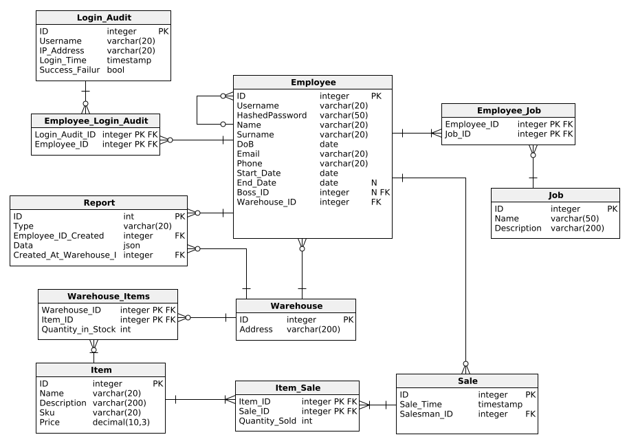
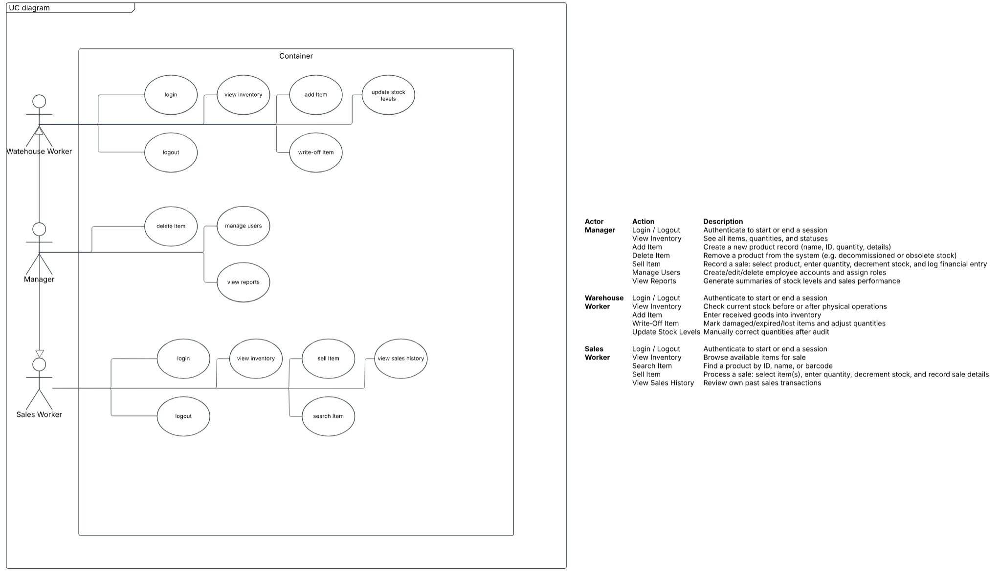
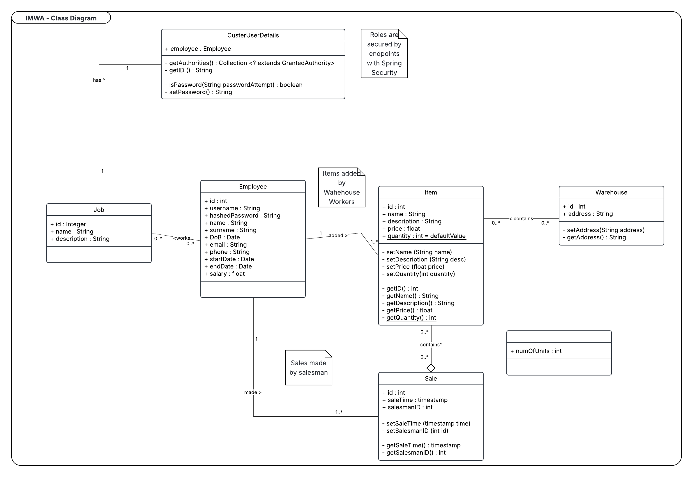

# 📦 Inventory Management Web App – Vortex Solution

A web-based inventory management system built to streamline warehouse operations and sales tracking. This project serves as a proof-of-concept (POC) with plans for future integration of barcode scanning and POS systems.

---

## Project Goals & Vision

### Version 1: Proof of Concept (Current)
- Add, remove, or sell items from inventory via web interface.

### Version 2: Barcode Integration
- Automatically generate unique SKU for new items.
- Print barcodes for tagging products.

### Version 3: Barcode Scanning
- Use USB barcode scanner to retrieve item info.
- Update inventory and finance tables upon sales or removal.

### Version 4: Enterprise POS Integration *(Future Goal)*
- Integrate with POS systems to process payments.
- Automatically reduce inventory and record sales upon payment success.

---

## Prerequisites

- **Java** 17 or higher
- **Gradle** (Wrapper included)
- **MySQL** (Database setup required >> FUTURE)

---

## Contributing
To contribute, please follow the steps below to ensure a smooth and successful submission

### Setup

1. **Clone the Repository**
Clone the repository to your local machine in your desired path (traverse to it using cd in terminal):
    ```bash
    git clone https://github.com/Vortex-Sol/InventoryManagementWeb.git
    cd InventoryManagementWeb   
    ```

2. **Create a New Branch**
Create a new branch to isolate your changes & features. Use a descriptive branch name:
    ```bash
    git checkout -b feature.name-category
    ```

Where:
   - Feature is the code you are working on
   - Category is the status of the feature; **use**: 
     - _fix_ [You are fixing a bug]
     - _patch_ [You forgot to add something] 
     - _update_ [You are creating a new feature] 
     - _temp_ [You are temporarily introducing a feature -> to be removed later]
     
Example branch name:
```
git checkout -b report.system-update
```
    
> **Tip:** Avoid making changes on the main branch explicitly

### Submitting Changes
1. **Make Your Changes**
   - Make your edits or additions to the codebase
   - Ensure your code is **formatted properly** and follows standard style guides
   - **Write test**, if applicable, for any new functionality
   - Verify everything works correctly before commiting

2. **Fetch Newest  Main**
    - Make sure you are on the newest main
    - Do ```git fetch origin main```
    - To resolve any merge conflicts >> contact the team
   
3. **Commit Your Changes**
Use clear, descriptive commit messages
    ```bash
    git add .
    git commit -m "Update: implemented Report System" -m "I created the appropriate Mappers, DTOs and Models. We are missing a service class"
    ```
4. **Push to Your Fork**
Push changes to your forked repository:
    ```bash
    git push origin report.system-update
    ```

5. **Open a Pull Request (PR)**
- Go to the original repository on GitHub
- Click "Compare & Pull Request" next to your recently pushed branch
- Title should be relevant feature issue
  - for e.g., **[3B] Report System**
- Provide a detailed description of your changes and what they do
  - for e.g., _The report system creates reports based on period or time for employees, receipts, inventory or all. A report includes...._ 
- Submit the pull request for review
  - assign 2 team members as reviewers to review your changes
  - assign yourself as an assignee
  - assign a label to the pull request

6. **Respond to Review Feedback**
- Be responsive to any comments, questions or change requests from the team members
- Push follow-up commits to the same branch; the PR will update automatically
- Finally merge to main once everyone approve

---

## Installation

1. **Clone the Repository**
   ```bash
   git clone https://github.com/Vortex-Sol/InventoryManagementWeb.git
   cd InventoryManagementWeb
   ```
   
2. **Build the Application**
    ```bash
    ./gradlew build
    ```
    
3. **Run the App**
    ```bash
    ./gradlew bootRun
    ```
    and access locally

---

## System Users

| Role     | Responsibilities                                                  |
|----------|-------------------------------------------------------------------|
| Salesman | Sell items, view sales history                                    |
| Stocker  | Add/write-off/update/delete items                                 |
| Manager  | Same as Salesman & Stocker, has access to report & receipt system |
| Admin    | Has IT settings system                                            |

---

## Technology Stack

| Layer      | Technology                                   |
|------------|----------------------------------------------|
| Frontend   | HTML, CSS, Bootstrap 5, JavaScript           |
| Templating | Thymeleaf (Server-side rendering)            |
| Backend    | Java Spring Boot (MVC)                       |
| Security   | Spring Security with JWT, Email Verification |
| ORM        | Spring Data JPA (Hibernate)                  |
| Database   | H2 (Development) & MySQL (Production)        |
| Testing    | JUnit, Mockito, Spring Test                  |

---

## Core Functionalities
Core Functionalities are tied to a user's warehouse. That is, user can only overlook and operate within his Warehouse bounds.

### Common to All Users
- Login / Logout

### Stocker
- Add Item
- Delete Item
- Edit Item
- Write-off (damaged/lost)
- Manual Stock Adjustments

### Salesman
- Sell Item
- Search by ID/Name/Barcode
- View Own Sales History

### Manager
- Salesman & Stocker Functionalities
- Capable of checking All employee data
- Employee, Sales & Inventory Reports
- Export to Google Sheets (optional)
- Dashboard with charts/statistics (optional)

### Admin
- Manages warehouse contact details
- Add/edits/removes employees
- He can set settings regarding stock, reports, cash count times and more

---

## API Endpoints

### Admin - [AdminController](src/main/java/vortex/imwp/controllers/AdminController.java)
| Method | Endpoint             | Description                      |
|--------|----------------------|----------------------------------|
| GET    | `/api/admin`         | Retrieves admin dashboard        |
| GET    | `/api/register`      | Loads Employee registration page |
| POST   | `/api/register`      | Creates Employee                 |

### Authentication - [AuthController](src/main/java/vortex/imwp/controllers/AuthController.java)
| Method | Endpoint        | Description             |
|--------|-----------------|-------------------------|
| GET    | `/auth/login`   | Retrieves login         |
| POST   | `/auth/logout`  | Logout and revoke token |

### Inventory - [InventoryController](src/main/java/vortex/imwp/controllers/InventoryController.java)
| Method | Endpoint      | Description                   |
|--------|---------------|-------------------------------|
| GET    | `/api/items`  | List all items (filterable)   |
| GET    | `/api/items/{id}` | Get item details              |
| POST   | `/api/items`  | Create new item               |
| PUT    | `/api/items/{id}` | Update item                   |
| DELETE | `/api/items/{id}` | Delete item                   |

### Stock Adjustments
| Method | Endpoint                         | Description                      |
|--------|----------------------------------|----------------------------------|
| POST   | `/api/items/{id}/adjust`         | Adjust stock (delta & reason)    |
| POST   | `/api/items/{id}/write-off`      | Write-off item                   |

### Sales
| Method | Endpoint             | Description                     |
|--------|----------------------|---------------------------------|
| GET    | `/api/sales`         | List sales (filterable)         |
| GET    | `/api/sales/{id}`    | Sale details                    |
| POST   | `/api/sales`         | Record sale                     |

### Users
| Method | Endpoint             | Description                     |
|--------|----------------------|---------------------------------|
| GET    | `/api/users`         | List users                      |
| GET    | `/api/users/{id}`    | Get user profile                |
| POST   | `/api/users`         | Create user                     |
| PUT    | `/api/users/{id}`    | Update user                     |
| DELETE | `/api/users/{id}`    | Delete user                     |

### Reports
| Method | Endpoint                        | Description                  |
|--------|---------------------------------|------------------------------|
| GET    | `/api/reports/inventory`        | View stock levels            |
| GET    | `/api/reports/sales`            | Sales report by date         |

---

## Database

### Diagrams

- Entity Relationship Diagram

- Use Case Diagram

- Class Diagram


---

### Database Schema (SQL)

> Full SQL setup for H2 is available under `/sql/schema.sql`.

### Sample Tables:
- **Employee**
- **Item**
- **Sale**
- **Warehouse**
- **Employee_Job**
- **Item_Sale**
- **Warehouse_Items**

### Notes:
- Proper **foreign keys** for relational integrity
- Includes `ALTER` and `DROP` scripts for migration handling

---

## Future Features
- Dashboard with KPIs and charts
- Barcode printing and scanning
- POS integration
- Google Sheets export
- Enhanced role permissions

---
